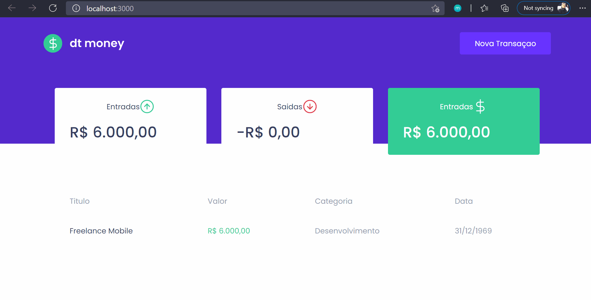

<h1 align="center">

  Dt Money
</br>


</h1>

</br>

<h2 align="center">



## 📖 Sobre

Esse projeto foi desenvolvido no curso de ReactJs da rocketseat, o projeto dt money foi criado para controlar suas finanças e ter um controle maior do seu dinheiro.

</br>
## 🚀 Tecnologias utilizadas

o proejto foi desenvolvido utilizando as seguintes tecnologias

 - ReactJS
 - Typescript
 - Styled-components
 - MirageJS


 # Contato

  <a hrf="https://www.linkedin.com/in/igor-amantinoipaussu/"> Linkedin</a>


 ## 📲 Como executar o projeto

 ````bash
    #Clonar o repositorio
    $ https://github.com/IgorGamantino/Dt-Money-ReactJs

    #Entrar no diretorio
    $ cd Dt-money

    #Instalar dependecias
    $ yarn

    #Executar
    $ yarn start
 ````
